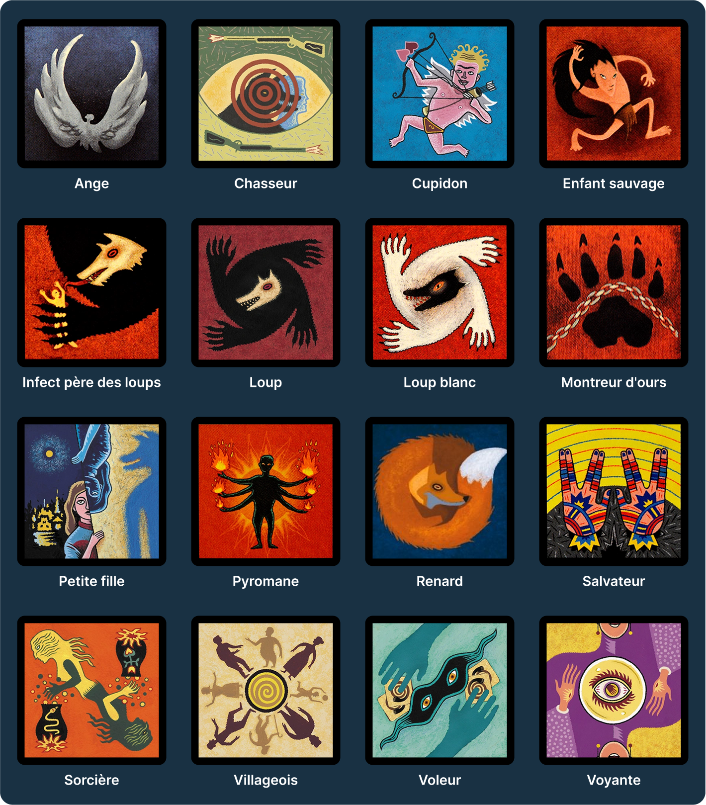

# Loups-garous sans cartes

Loups-garous sans cartes est un outil gratuit accessible en ligne qui permet de joueur au jeu du Loup garous de Thiercelieux irl sans les cartes physique.
Il simplifie ainsi les actions de certains rôles comme celui de la Voyante ou du Voleur.

Tout le monde peut créer une partie et la partager a ses amis via un QR Code. Le meneur va alors choisir la distribution des rôles de la partie avant de la lancer.

Le site est conçu pour être un support pour le déroulement de la partie. Les votes pour le maire et pour l'élimination d'un joueur se font toujours à main levé et le meneur qui applique la décison du village sur le site.

	

### L'outil est actuellement accessible à l'adresse **[lg.cjosse.com](https://www.lg.cjosse.com/)**

## Les rôles actuellement supportés sont les suivants:

	

